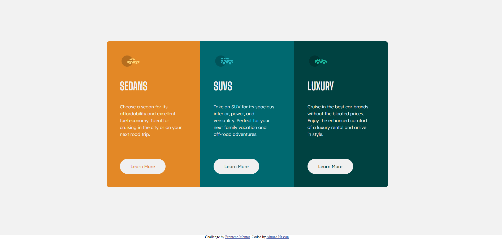

# 3 Column Preview Card Component 👨‍💻

## Project Overview 🌟

This is a front-end coding challenge completed for [Frontend Mentor](https://www.frontendmentor.io). The challenge was to build a 3 column preview card component and make it look as close to the provided design as possible.

## Technologies Used 💻

- HTML
- CSS

### The Challenge 📋

The challenge required the following:

- View the optimal layout depending on their device's screen size
- See hover states for interactive elements

## Screenshots 📷

## Live Demo 🚀

You can view the live demo of the project [here](https://3-column-preview-card-component-007.netlify.app/).